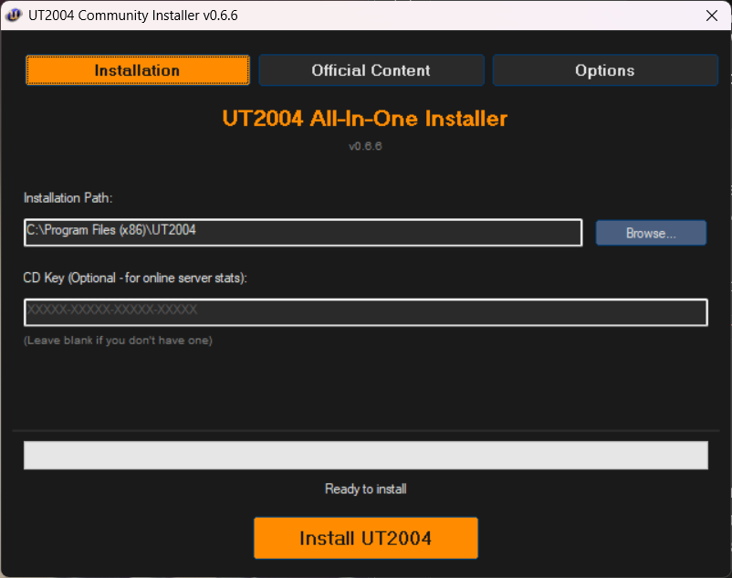
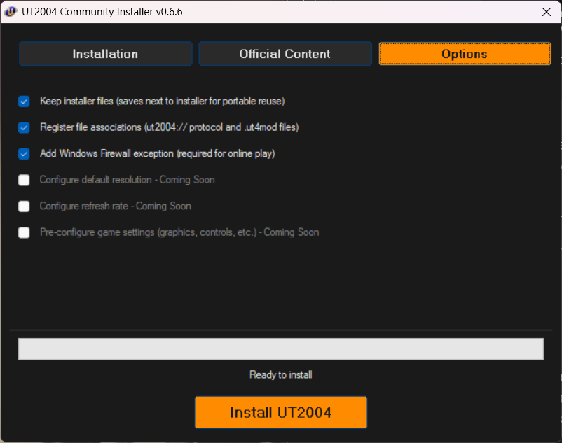
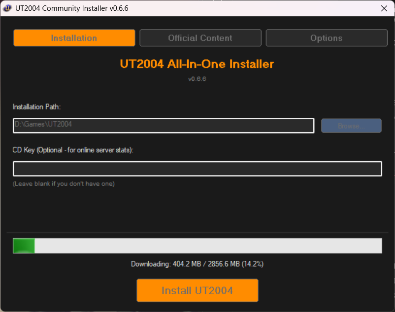

# UT2004 All-In-One Community Installer

A modern, automated installer for **Unreal Tournament 2004** with support for all official bonus content, built with AutoIt.


## 📸 Screenshots

| Installation | Official Content |
|:---:|:---:|
|  |  |

| Options | Installing |
|:---:|:---:|
|  |  |

## 🎮 Features

### Core Installation
- ✅ **Automated ISO Download** - Downloads UT2004 retail ISO (~2.8 GB) with caching
- ✅ **CAB Extraction** - Uses 7-Zip and unshield to extract game files
- ✅ **OldUnreal Patch** - Auto-downloads and applies latest community patch
- ✅ **Full Registry Support** - Complete compatibility settings
- ✅ **File Associations** - Registers `ut2004://` protocol and `.ut4mod` files
- ✅ **Shortcuts** - Desktop, Start Menu (game, editor, manual) and install root shortcuts
- ✅ **Windows Firewall Rules** - Automatic exception for online play

### Bonus Content (Optional)
All bonus packs can be selected individually:

- ✅ **MegaPack** - ECE content + 9 bonus maps (~190 MB)
  - 6 Characters (Mekkor, Skrilax, Barktooth, Karag, Kragoth, Thannis)
  - 3 Vehicles (SPMA, Paladin, Cicada)
  - 4 ONS Maps + 5 AS Maps

- ✅ **Community Bonus Pack 1** - 19 community maps (~138 MB)
- ✅ **Community Bonus Pack 2 Volume 1** - 21 community maps (~195 MB)
- ✅ **Community Bonus Pack 2 Volume 2** - 20 maps (~192 MB)

**Total: 200+ maps available!**

### User Experience
- 🎨 **UT2004-Themed Interface** - Dark theme with signature orange accents
- 📑 **Tabbed Layout** - Clean organization (Installation / Official Content / Options)
- 📊 **Progress Tracking** - Real-time status updates
- 💾 **Portable Download Cache** - Keep downloaded files next to installer for reuse
- 🗑️ **Professional Uninstaller** - Complete removal with user settings option

## 📥 Download

**Latest Release:** [v0.6.8](https://github.com/EddCase/UT2004-AIO-Installer/releases/latest)

Simply download `UT2004_Installer.exe` and run - no other files needed!

### ⚠️ Windows Defender Warning

**Windows Defender may flag this installer as suspicious.** This is a **false positive** caused by:
- AutoIt script compilation (legitimate automation tool)
- Registry modifications (required for game installation)
- File downloads from the internet
- System folder access

**This installer is safe:**
- ✅ **100% Open Source** - All code visible on GitHub
- ✅ **Scanned on VirusTotal** - [View scan results](https://www.virustotal.com/gui/file/1f90853b758f708f2fca84558d7ea2e0969e930bf1d70274d14fa93350751f2b/detection)
- ✅ **Submitted to Microsoft** as false positive
- ✅ **Community verified** - Build from source yourself if concerned

**To use the installer:**

**Option 1 - Add Exception (Recommended):**
1. Windows Security → Virus & threat protection → Manage settings
2. Exclusions → Add exclusion → File
3. Select `UT2004_Installer.exe`

**Option 2 - Build from Source:**
1. Download source code from GitHub
2. Install [AutoIt](https://www.autoitscript.com/)
3. Compile `UT2004_Installer_v0.6.8.au3` yourself
4. You'll see exactly what the installer does!

**Note:** This is a common issue with AutoIt-compiled programs. The installer performs no malicious actions - it only installs UT2004 and community patches.

## 🖥️ Requirements

- **OS:** Windows 7 or later (64-bit recommended)
- **Disk Space:** 
  - ~3.5 GB for base game
  - Additional ~700 MB for all bonus packs
  - ~7 GB during installation (temp files)
- **Administrator Rights:** Required for registry writes
- **Internet Connection:** Required for downloads

## 🚀 Usage

1. **Run** `UT2004_Installer.exe` as Administrator
2. **Choose** installation path (default: `C:\Program Files\UT2004`)
3. **Enter** CD key (optional - only needed for online stats)
4. **Select** which bonus packs to install (optional)
5. **Click** "Install UT2004"
6. **Wait** for installation to complete (~15-30 minutes depending on connection)
7. **Play!** Desktop shortcut or Start Menu → Unreal Tournament 2004

## 🎯 Installation Locations

### Default Install
- **Game Files:** `C:\Program Files\UT2004`
- **User Settings:** `My Documents\My Games\UT2004`
- **Temp Files:** `%TEMP%\UT2004_Install` (install.log kept, working files cleaned after install)
- **Download Cache:** Next to installer in `_Downloads\` (if "Keep installer files" checked)

### Shortcuts Created
- **Desktop:** `UT2004.lnk`
- **Start Menu:** `Unreal Tournament 2004\` folder containing `UT2004.lnk`, `UnrealEd.lnk`, `Manual.lnk`
- **Install Root:** `UT2004.lnk`, `UnrealEd.lnk`

### Registry Entries
- `HKLM\SOFTWARE\Unreal Technology\Installed Apps\UT2004`
- `HKLM\SOFTWARE\Microsoft\Windows\CurrentVersion\Uninstall\UT2004_Community`

## 🔧 Uninstalling

**Method 1:** Windows Settings → Apps → Unreal Tournament 2004 → Uninstall

**Method 2:** Run `Uninstaller.exe` from the game's System folder

The uninstaller removes:
- ✅ All game files
- ✅ Registry entries
- ✅ File associations
- ✅ Shortcuts
- ✅ Firewall rules
- ⚙️ Optional: Keep user settings/saved games
- ⚙️ Optional: Clean temporary installer files

## 🛠️ Technical Details

### Installation Process
1. **Phase 2:** Download UT2004 ISO (~2.8 GB)
2. **Phase 3:** Extract ISO with 7-Zip
3. **Phase 4:** Extract CAB files with unshield
4. **Phase 5:** Copy files to installation directory
5. **Phase 5c:** Create shortcuts
6. **Phase 6-9:** Install selected bonus packs (optional)
7. **Phase 5b:** Apply OldUnreal patch (always last!)
8. **Phase ConfigureGame:** Apply resolution and detail settings to UT2004.ini
9. **Phase Finalise:** Move/clean download cache and temp files

### Configurable Download URLs
The installer supports custom download URLs via `installer_settings.ini` (created automatically on first run). This allows hosting files on any server — Cloudflare R2, a personal server, etc. — without recompiling.

Example configuration:
```ini
[DownloadURLs_ISO]
URL=https://your-host.example.com/UT2004.ISO

[DownloadURLs_MegaPack]
Part1=https://your-host.example.com/MegaPack.z01
Part2=https://your-host.example.com/MegaPack.z02
Part3=https://your-host.example.com/MegaPack.zip
```

Any number of parts, any key names. Falls back to default URLs if section is missing.

### Bundled Tools
- **7-Zip** v24.08 (LGPL) - ISO and archive extraction
- **unshield** v1.6.2 (MIT) - InstallShield CAB extraction
- **zlib1.dll** - Compression library

All tools are embedded in the installer and extracted to temp directory during installation.

## 📝 Changelog

### v0.6.8 (2026-02-20)
**New Features:**
- Configurable download URLs via `installer_settings.ini` - host files anywhere (Cloudflare R2, custom server, etc.)
- `installer_settings.ini` created automatically on first run with example configuration
- Any number of parts per pack supported - key names in INI don't matter
- Single-file archive detection - if only one URL provided, 7z integrity test run automatically
- Portable cache updated - now matches cached files by URL-derived filename, not hardcoded names
- ISO filename derived from URL - no longer assumes file is always called `UT2004.ISO`
- Falls back to default GitHub URLs if no INI section found

**Improvements:**
- Generic `DownloadPackFiles()` function replaces repeated download logic across all bonus pack phases
- Generic `GetDownloadURLs()` function reusable for any future download types
- Download logic completely separated from extraction/install logic

### v0.6.7 (2026-02-18)
**New Features:**
- Auto-detect monitor resolution and refresh rate via WMI
- Set Holy S**t! (Maximum detail settings) option
- FirstRun protection for max detail settings using detected patch version
- Resolution and detail settings applied before first game launch

### v0.6.6 (2026-02-17)
**New Features:**
- UnrealEd shortcut in install root and Start Menu
- Manual shortcut in Start Menu
- Portable download cache - all bonus pack archives now correctly moved next to installer when "Keep installer files" is checked
- Smart temp cleanup - large extracted folders deleted after install, install.log always preserved

**Bug Fixes:**
- Fixed bonus pack archives not being moved to portable cache (was running before downloads completed)
- Fixed broken FileCopy fallback that only copied top-level files
- Fixed stale v0.6.4 version strings showing in title bar and Options tab

**Improvements:**
- Global version constant - single change needed for future version bumps
- Phase_Finalise() - cleanup now runs after all downloads complete
- Phase5c renamed to Phase5c_Shortcuts() - cleaner separation of concerns

### v0.6.5 (2026-02-17)
**New Features:**
- Windows Firewall rules for online play
- INI settings persistence (installer_settings.ini)
- Portable _Downloads cache (moved next to exe when Keep Files checked)
- Bonus Pack download caching (skip re-download if already kept)

### v0.6.1 (2026-02-16)
**Bug Fixes:**
- Fixed Uninstaller.exe not being copied to System folder
- Moved Tools extraction to temp directory (no more leftover Tools folder)
- Removed TrayTip notifications for cleaner experience
- Fixed filename mismatch (Uninstall.exe → Uninstaller.exe)

### v0.6.0 (2026-02-16)
**New Features:**
- Professional uninstaller with UT2004 theming
- Uninstaller removes all files, registry, shortcuts, file associations
- Uninstaller options: keep settings, clean temp files
- Registry UninstallString properly configured

### v0.5.3 (2026-02-16)
**New Features:**
- Community Bonus Pack 1 (19 maps)
- Community Bonus Pack 2 Volume 1 (21 maps)
- Community Bonus Pack 2 Volume 2 (20 maps)
- All bonus packs fully implemented and tested

[Full Changelog](CHANGELOG.md)

## 🤝 Contributing

This is a community project! Contributions are welcome:

- 🐛 **Bug Reports:** [Open an issue](https://github.com/EddCase/UT2004-AIO-Installer/issues)
- 💡 **Feature Requests:** Suggest improvements
- 🔧 **Pull Requests:** Code contributions welcome

## 📜 License

This installer is released under the **MIT License**.

### Third-Party Components
- **7-Zip:** LGPL License - Copyright (C) Igor Pavlov
- **unshield:** MIT License - Copyright (C) 2003 David Eriksson
- **zlib:** zlib License - Copyright (C) Jean-loup Gailly and Mark Adler

### UT2004 Content
Unreal Tournament 2004 is © Epic Games, Inc. This installer does not include any game files - it downloads the retail ISO and applies community patches. You must own a legitimate copy of UT2004 to use this installer.

## 🙏 Credits

- **Installer Development:** EddCase
- **OldUnreal Patch:** OldUnreal Team ([GitHub](https://github.com/OldUnreal/UT2004Patches))
- **Community Bonus Packs:** UT2004 Mapping Community
- **Tool Authors:** Igor Pavlov (7-Zip), David Eriksson (unshield)

## 📞 Support

- **Issues:** [GitHub Issues](https://github.com/EddCase/UT2004-AIO-Installer/issues)
- **Discussions:** [GitHub Discussions](https://github.com/EddCase/UT2004-AIO-Installer/discussions)

## ⚠️ Disclaimer

This is an unofficial community installer. It is not affiliated with or endorsed by Epic Games. Use at your own risk. Always scan downloaded executables with antivirus software.

---

**Enjoy fragging!** 🚀🎮
